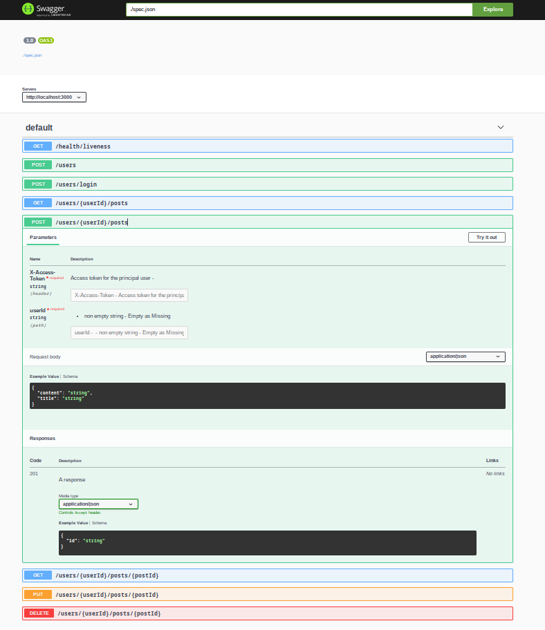

[](https://central.sonatype.com/artifact/io.github.memoizr/snitch-bootstrap)
[](https://opensource.org/licenses/Apache-2.0)
[]()

## Snitch 
Snitch helps you create a production-grade HTTP layer for your applications and (micro)services with minimal effort. To create ***complete*** documentation for them with ***no*** effort.

Snitch is a thin layer built upon long-established and well-supported embedded web servers such as Undertow. Thanks to Kotlin's inlining capabilities the performance of Snitch is essentially the same as that of the underlying web server.

Our primary goals are:
- To create the most readable and maintainable API for creating web services
- By readable we mean readable production code where routes are complex, parameters need validation, parsing and mapping to domain types, errors need to be handled, deal with authentication and permissions, etc.
- To fully automate the creation of documentation for your services 
- To have a strongly typesafe approach to HTTP layer modelling
- To be as lightweight and performant as possible
- To not use any reflection, annotations or code generation for production code
- To be async by default without sacrificing readability
- To be small and get out of the way. The HTTP layer is not the most interesting part of your application, and it should not be the most complex one either.
- To have a small learning curve despite it being a DSL

<!-- TOC -->
  * [Snitch](#snitch-)
      * [How to install it](#how-to-install-it)
      * [Getting started](#getting-started)
    * [Features](#features)
      * [Expressive routing](#expressive-routing)
      * [Expressive handlers](#expressive-handlers)
      * [Expressive and exendable parameter definition, parsing and validation](#expressive-and-exendable-parameter-definition-parsing-and-validation)
      * [Strongly typed inputs and outputs](#strongly-typed-inputs-and-outputs)
      * [Middleware](#middleware)
      * [Guards and Conditions](#guards-and-conditions)
      * [Fully automated documentation](#fully-automated-documentation)
      * [Performance](#performance)
      * [Coroutines](#coroutines-support)
      * [Small learning curve](#small-learning-curve)
      * [Learning resources](#learning-resources)
      * [Community support](#community-support)
      * [Why does it exist](#why-does-it-exist)
      * [Who is it for?](#who-is-it-for)
      * [System requirements](#system-requirements)
      * [How to contribute](#how-to-contribute-)
    * [Show Your Support](#show-your-support)
<!-- TOC -->

#### How to install it

```kotlin
dependencies {
    implementation("io.github.memoizr:snitch-bootstrap:1.0.0")
}
```

#### Getting started

```kotlin
snitch(GsonJsonParser)
    .onRoutes {
        GET("/hello") isHandledBy { "world".ok }
    }
    .start()
    .serveDocumenation()
```

### Features
#### Expressive routing
```Kotlin
val usersController = routes {
    POST() with body<CreateUserRequest>() isHandledBy createUser
    POST("login") with body<LoginRequest>() isHandledBy userLogin

    userId / "posts" / {
        authenticated {
            GET() onlyIf principalEquals(userId) isHandledBy getPosts
            POST() onlyIf principalEquals(userId) with body<CreatePostRequest>() isHandledBy createPost

            GET(postId) isHandledBy getPost
            PUT(postId) with body<UpdatePostRequest>() onlyIf principalEquals(userId) isHandledBy updatePost
            DELETE(postId) onlyIf (principalEquals(userId) or hasAdminRole) isHandledBy deletePost
        }
    }
}
```

#### Expressive handlers
```Kotlin
...
val getPosts by handling {
    postsRepository().getPosts(principal).toResponse.ok
}

val createPost by parsing<CreatePostRequest>() handling {
    postsRepository().putPost(
        CreatePostAction(
            principal,
            PostTitle(body.title),
            PostContent(body.content),
        )
    )
    .mapSuccess {
        SuccessfulCreation(value).created
    }.mapFailure {
        FailedCreation().badRequest()
    }
}
...
```
#### Expressive and exendable parameter definition, parsing and validation
```Kotlin
val userId by path()
val postId by path(ofPostIdValidator)
val accessToken by header(ofValidAccessToken)

// Your custom parameter validation and parsing logic
val ofValidAccessToken = stringValidator("valid jwt") { jwt().validate(it) }
```

#### Strongly typed inputs and outputs
Headers, paths, query parameters and bodies always require validation and mapping to domain types. Snitch makes it easy to do so.
```kotlin 
val limit by query(ofNonNegativeInt(max = 30))
val offset by query(ofNonNegativeInt())

val postId by path(ofPostIdValidator)
```
In the example above `limit` and `offset` are validated and mapped to `UInt` values. `postId` is validated and mapped to a `PostId` value object.

Therefore in the handler you can do this:
```kotlin
val getPosts by handling {
    postsRepository().getPosts(request[userId], request[limit], request[offset]).toResponse.ok }
```
The parameters are validated and safe to use. If they are not valid the request will not be handled and the client will receive a `400 Bad Request` response with a list of reasons about all the parameters which are either not supplied or invalid.

#### Middleware
Here's how you would define a simple logger middleware
```kotlin
val Router.log get() = decorateWith {
        logger().info("Begin Request: ${request.method.name} ${request.path}")
        next().also {
            logger().info("End Request: ${request.method.name} ${request.path}")
        }
    }

val rootRouter = routes {
    log {
        "health" / healthController
        "users" / usersController
    }
}
```

#### Guards and Conditions
Snitch provides a powerful conditions system that allows you to control access to your endpoints with a clean, expressive syntax.

Conditions are boolean expressions that determine whether a request should proceed or be rejected. They can be applied to individual endpoints or entire route hierarchies.

```kotlin
// Define conditions
val hasAdminRole = condition("hasAdminRole") {
    when (role) {
        ADMIN -> ConditionResult.Successful
        else -> ConditionResult.Failed("Not an admin".forbidden())
    }
}

val isResourceOwner = condition("isResourceOwner") {
    if (principal.id == request[resourceId]) ConditionResult.Successful
    else ConditionResult.Failed("Not the resource owner".forbidden())
}

// Apply conditions to endpoints
GET("resource" / resourceId) onlyIf isResourceOwner isHandledBy { getResource() }
DELETE("resource" / resourceId) onlyIf (isResourceOwner or hasAdminRole) isHandledBy { deleteResource() }
```

Conditions support logical operators for complex access rules:
- `and` - Both conditions must be true
- `or` - At least one condition must be true
- `not` (using `!` operator) - Inverts the condition

```kotlin
// Complex condition example
PUT("resource" / resourceId) onlyIf (isResourceOwner and !isResourceLocked) isHandledBy { updateResource() }
```

You can also apply conditions to entire route hierarchies:

```kotlin
onlyIf(hasAdminRole) {
    GET("admin/dashboard") isHandledBy { getDashboard() }
    GET("admin/users") isHandledBy { getUsers() }
    POST("admin/settings") isHandledBy { updateSettings() }
}
```

For more details, check out our [Mastering Snitch Conditions](guides/docs/in depth/Mastering-Snitch-Conditions.md) tutorial.

#### Fully automated documentation
Snitch outputs OpenAPI 3.0 docs. Absolutely any of the inputs and any of the outputs are documented automatically, even response codes. No work or setup is required from the user to achieve this. Snitch allows the user to specify whether to serve the documentation on a given route. This is an interactive page based on Swagger-UI that allows a viewer to interact with the API, authenticate, and make any request and see the responses. You can optionally annotate individual fields of requests, responses or parameters to add additional descriptions or provide example values so that it'd be straightforward to use the API through the documentation page, as requests would be pre-populated with such example values. Documentation can either be served on the same service, or given to a doc aggregator that allows to provide a unified API for multiple services. Request, Response and parameter types are automatically generated exclusively from type information from the Kotlin language, hence they always represent the actual behaviour of the API.


Adding this line to the service configuration will generate the documentation and serve it on the `/docs` route, which can be configured along with the rest of the application settings.
```Kotlin
    .generateDocumentation()
    .servePublicDocumenation()
```
This is an example screenshot of the interactive Swagger-UI page that it serves at the `/docs` route:   



Every endpoint can be interacted with, and the documentation is always up-to-date with the actual behaviour of the API.

#### Performance
Snitch uses Undertow as the default embedded web server. Undertow was chosen because it's the fastest embedded web server for the JVM for most use cases, and for its async-first approach based on NIO. It's also the most lightweight one, with a small classpath and a small memory footprint. That said, it's possible to use any other web server with Snitch, as it's not tied to Undertow in any way, so if another web server is preferred it can be used instead.

Snitch is designed to be only a very thin overlay on top of the embedded webserver, so it does not add any overhead to the request handling process. It's designed to be as fast as possible, and it's therefore almost as fast as the underlying web server is. Object instantiation is kept to a minium to not cause GC pressure. Call stack is also kept as shallow as possible.
Reflection is not used at all, and the only reflection that happens is when the documentation is generated, which is an optional step for production code that would occour at most once during startup. This is done only once, and the results are cached, so it does not happen on every request. 
The application has a small classpath, and the only dependencies are the web server and the JSON library. This means that the application can be deployed as a single jar file, and it's easy to deploy and run it in a containerized environment. A small application complete with documentation can run in as little as 12MB of ram on top of the JVM. This library has been successfuly used in a variety of settings, from resource constrained environments such as Android to high performance environments such as high throughput microservices. 

#### Coroutines support
Snitch lets you use coroutine code seamlessly. For more information see the [documentation](docs/Docs.md#coroutine-support). 

#### Small learning curve
The library is actually very small and a complete detailed overview can be had in a matter of hours. Powerful features such as guards, middleware and others are built on top of a small number of core concepts, and really there isn't any magic involved. The codebase only has a few thousand lines of code. Given a fluency of the Kotlin language it should be one of the easiest frameworks to truly understand how it works. Really it's just a thin wrapper around the embedded web server.

#### Learning resources
- [Quick Start Guide](guides/docs/tutorials/QuickStart.md) - Get up and running in minutes
- [Artifacts Overview](guides/docs/resources/Artifacts.md) - Learn about all Snitch modules
- [Using Shank](guides/docs/tutorials/UsingShank.md) - Dependency injection guide
- [Advanced Shank Patterns](guides/docs/tutorials/ShankPatterns.md) - Design patterns for Shank
- [Documentation](guides/docs/Docs.md) - Full library documentation
- [Tutorials](guides/docs/in depth/README.md) - Step-by-step guides
- [Example Project](example) - A complete reference implementation of a Reddit-like service
  
The example project demonstrates production-like qualities such as:
- Authorization and authentication flow
- Database interaction
- Integration with dependency injection (Shank)
- Testing strategies

#### Community support
Join us on our [discord server](https://discord.gg/bG6NW3UyxS) to ask questions, get help, or just to chat. We're a small but growing community but we're friendly and we're always happy to help.

#### Why does it exist
Because code should be as readable as possible, and it should not require much ceremony to do simple stuff. If you want to do complex stuff it should be simple to extend the framework to do so. Resources are precious, you should not waste them on reflection or huge classpaths for doing basic stuff. Documentation is crucial, it should be generated automatically and be always up to date, and nobody should ever touch OpenAPI YAML or JSON files: we stand for these basic human rights.

#### Who is it for?
- It's for those who like their code to look good, fast and be well documented.
- Those who don't like pomp and ceremony to do their basic boring tasks
- For those who'd take a smaller tool over a larger one to do the same job
- For those who like to control-click on a method to see what it's doing and not end up in a reflection hell
- For those who like to see their code compile and not have to wait for the runtime to tell them they made a typo 
- Those who like aspects of Object-Oriented as well as Functional Programming and want to use both to their advantage
   
#### System requirements
- Java 17 or higher

#### How to contribute  
This library evolved over the years, initially as an internat tool deployed in a variety of scenarios, but now released as an open-source project. To contribute, please fork the repository and submit a pull request. We will review it as soon as possible. If you have any question open an issue, and we'll try to address it as soon as possible. Alternatively, join our [discord server](https://discord.gg/bG6NW3UyxS) to get in touch. We have many beginner-friendly tasks, and we can offer plenty of support. This can be a great opportunity to learn some really advanced Kotlin concepts!

### Show Your Support
If you find this project useful, and you'd like to support our work, please consider giving it a ⭐️ on GitHub! Your support means a lot to us and helps us continue improving the library. 

Click [here](https://github.com/memoizr/snitch/stargazers) to star the repo. Thank you!
